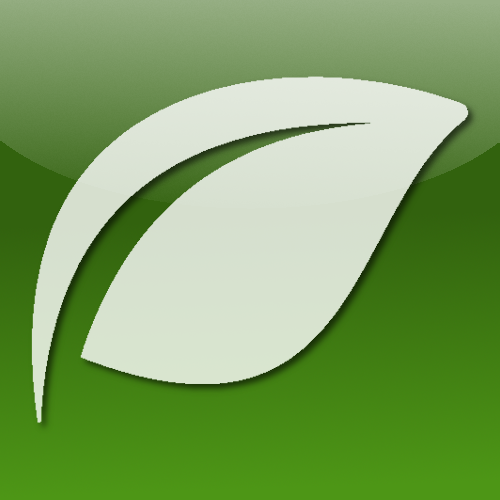

     <picture>
          <source media="(prefers-color-scheme: dark)" srcset="./public/logo-dark-aero.png" />
          <source media="(prefers-color-scheme: light)" srcset="./public/logo-aero.png" />
          
     </picture>

<h1 align="center">Calm Mood Desktop</h1>

A meditation app that helps you calm the human nervous system in case of stress, tension or depression. Your local mental stabilizer!

     <a href="https://calm-mood.vercel.app/">View Demo</a>
     &nbsp;&middot;&nbsp;
     <a href="https://github.com/ArsenGabrielyan/calm-mood-desktop/issues/new?assignees=&labels=&template=bug_report.md&title=">Report bug</a>
     &nbsp;&middot;&nbsp;
     <a href="https://github.com/ArsenGabrielyan/calm-mood-desktop/issues/new?assignees=&labels=&template=feature_request.md&title=">Request Feature</a>

![version][version-shield]
[![Contributors][contributors-shield]][contributors-url]
[![Forks][forks-shield]][forks-url]
[![Stargazers][stars-shield]][stars-url]
[![downloads][downloads-shield]][downloads-url]
[![project_license][license-shield]][license-url]

[![Issues][issues-shield]][issues-url]
[![build-status][status-shield]][status-url]
![commits since latest release][commits-since-shield]
![GitHub Created At][created-at-shield]
![GitHub repo size][repo-size-shield]

     
Table of Contents

     <ol>
          <li>
               <a href="#about">About</a>
               <ul>
                    <li><a href="#built-with">Built with</a></li>
                    <li><a href="#download">Download</a></li>
               </ul>
          </li>
          <li><a href="#usage">Usage</a></li>
          <li><a href="#versioning">Versioning</a></li>
          <li>
               <a href="#contributing">Contributing</a>
               <ul>
                    <li><a href="#top-contributors">Top Contributors</a></li>
               </ul>
          </li>
          <li><a href="#star-history">Star History</a></li>
          <li><a href="#license">License</a></li>
     </ol>

## About
**Calm Mood Desktop** is the offline version of **Calm Mood**. This app helps to calm the human nervous system, creating a spiritually peaceful environment. It awakens a love for nature, helping a person feel calm and harmonious. A person will learn new things about
- The forest
- Rivers
- Birds
- Other wonders of nature
 
reconnecting with nature in a new way. Visit the [Website][website-url] to try it :-)

### Built with
- [![Tauri][tauri-shield]][tauri-url]
- [![React][react-shield]][react-url]
- [![ShadCN UI][shadcn-shield]][shadcn-url]
- [![Tailwind CSS][tailwind-shield]][tailwind-url]
- [![Typescript][typescript-shield]][typescript-url]
- [![Vite][vite-shield]][vite-url]
- [![Rust][rust-shield]][rust-url]
- [![React Router][react-router-shield]][react-router-url]

### Planned Improvements
#### v0.3.0 (Expansion, Next)
- [ ] Pomodoro Timer Support
- [ ] About Page
#### v0.4.0 (Stability)
- [ ] Updater support

### Download
You can find the latest stable version of Calm Mood Desktop right here

[![GitHub Downloads (all assets, latest release)][download-shield]][download-url]

## Usage
1. Explore key features in the app:
   - **Breathing Exercise**: Guided inhale, hold, exhale with animations.
   - **Relaxing Sounds**: Mix and match ambient sounds (birds, rain, waves, etc.).
   - **Pomodoro Method**: Recover time sensibility by using this feature (Make sure to leave the window open)
   - **Themes**: Switch between Light and Dark modes.
2. Adjust sound volumes individually to create your personal ambience.
3. Configure some settings in the Breathing Exercise page if needed
4. Configure Pomodoro Timer settings in the Pomodoro page if needed

## Versioning
This website follows [Semantic Versioning](https://semver.org/). You can view the full [Changelog][changelog-url] for details on each website version.

## Contributing
Contributions are Always Welcome! Please read both [Code of Conduct][code-of-conduct-url] and [CONTRIBUTING.md][contributing-url] before contributing.

### Top Contributors
[![Top Contributors][top-contributors]][contributors-url]

## Star History
[![Star History Chart][star-history-chart]][star-history-url]

## License
Distributed under the MIT License. See [LICENSE.md][license-url] for more information.

> GitHub [@ArsenGabrielyan][github-url] &nbsp;&middot;&nbsp;
> [Arsen's Website][personal-site-url]

<!-- Markdown stats links -->
[star-history-chart]: https://api.star-history.com/svg?repos=ArsenGabrielyan/calm-mood-desktop&type=Date
[star-history-url]: https://api.star-history.com/svg?repos=ArsenGabrielyan/calm-mood-desktop&type=Date
[contributors-shield]: https://img.shields.io/github/contributors/ArsenGabrielyan/calm-mood-desktop.svg?style=for-the-badge
[contributors-url]: https://github.com/ArsenGabrielyan/calm-mood-desktop/graphs/contributors
[top-contributors]: https://contrib.rocks/image?repo=ArsenGabrielyan/calm-mood-desktop
[forks-shield]: https://img.shields.io/github/forks/ArsenGabrielyan/calm-mood-desktop.svg?style=for-the-badge
[forks-url]: https://github.com/ArsenGabrielyan/calm-mood-desktop/network/members
[stars-shield]: https://img.shields.io/github/stars/ArsenGabrielyan/calm-mood-desktop.svg?style=for-the-badge
[stars-url]: https://github.com/ArsenGabrielyan/calm-mood-desktop/stargazers
[issues-shield]: https://img.shields.io/github/issues/ArsenGabrielyan/calm-mood-desktop.svg?style=for-the-badge
[issues-url]: https://github.com/ArsenGabrielyan/calm-mood-desktop/issues
[license-shield]: https://img.shields.io/github/license/ArsenGabrielyan/calm-mood-desktop?style=for-the-badge
[license-url]: https://github.com/ArsenGabrielyan/calm-mood-desktop/blob/main/LICENSE.md
[created-at-shield]: https://img.shields.io/github/created-at/ArsenGabrielyan/calm-mood-desktop?style=for-the-badge
[repo-size-shield]: https://img.shields.io/github/repo-size/ArsenGabrielyan/calm-mood-desktop?style=for-the-badge
[code-of-conduct-url]: https://github.com/ArsenGabrielyan/calm-mood-desktop/blob/main/CODE_OF_CONDUCT.md
[contributing-url]: https://github.com/ArsenGabrielyan/calm-mood-desktop/blob/main/CONTRIBUTING.md
[changelog-url]: https://github.com/ArsenGabrielyan/calm-mood-desktop/blob/main/CHANGELOG.md
[website-url]: https://calm-mood.vercel.app/
[version-shield]: https://img.shields.io/github/package-json/v/ArsenGabrielyan/calm-mood-desktop?style=for-the-badge
[downloads-shield]: https://img.shields.io/github/downloads/ArsenGabrielyan/calm-mood-desktop/total?style=for-the-badge&label=Total%20Downloads
[downloads-url]:https://github.com/ArsenGabrielyan/calm-mood-desktop/releases
[status-shield]: https://img.shields.io/github/actions/workflow/status/ArsenGabrielyan/calm-mood-desktop/build.yml?style=for-the-badge
[status-url]: https://github.com/ArsenGabrielyan/calm-mood-desktop/actions/workflows/build.yml
[commits-since-shield]: https://img.shields.io/github/commits-since/ArsenGabrielyan/calm-mood-desktop/latest?style=for-the-badge&color=%label=Commits%20since%20latest%20version
[download-shield]: https://img.shields.io/github/downloads/ArsenGabrielyan/calm-mood-desktop/latest/total?style=for-the-badge&label=Download
[download-url]: https://github.com/ArsenGabrielyan/calm-mood-desktop/releases/latest

<!-- Languages -->
[tauri-shield]: https://img.shields.io/badge/Tauri-FFC131?style=for-the-badge&logo=Tauri&logoColor=white
[tauri-url]: https://tauri.app/
[react-shield]: https://img.shields.io/badge/React-20232A?style=for-the-badge&logo=react&logoColor=61DAFB
[react-url]: https://react.dev/
[shadcn-shield]: https://img.shields.io/badge/shadcn%2Fui-000000?style=for-the-badge&logo=shadcnui&logoColor=white
[shadcn-url]: https://ui.shadcn.com/
[tailwind-shield]: https://img.shields.io/badge/Tailwind_CSS-38B2AC?style=for-the-badge&logo=tailwind-css&logoColor=white
[tailwind-url]: https://tailwindcss.com/
[typescript-shield]: https://img.shields.io/badge/TypeScript-007ACC?style=for-the-badge&logo=typescript&logoColor=white
[typescript-url]: https://www.typescriptlang.org/
[vite-shield]: https://img.shields.io/badge/Vite-B73BFE?style=for-the-badge&logo=vite&logoColor=FFD62E
[vite-url]: https://vite.dev/
[rust-shield]: https://img.shields.io/badge/Rust-000000?style=for-the-badge&logo=rust&logoColor=white
[rust-url]: https://rust-lang.org/
[react-router-shield]: https://img.shields.io/badge/React_Router-CA4245?style=for-the-badge&logo=react-router&logoColor=white
[react-router-url]: https://reactrouter.com

<!-- Screenshots -->
[exercise-screenshot]: ./.github/demo-exercise.png
[sounds-screenshot]: ./.github/demo-sounds.png

<!-- External Links -->
[github-url]: https://github.com/ArsenGabrielyan
[personal-site-url]: https://arsen-2005.vercel.app